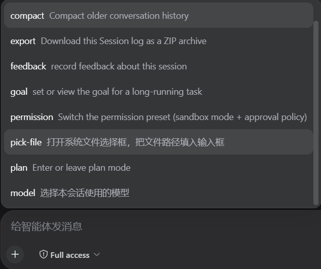

# dsh-file-drop — 拖放文件到 DSH 输入框

把文件/文件夹拖到 DSH 窗口任意位置，**真实磁盘路径瞬间写入对话输入框**——零内容传输，与文件大小无关。

## 特性

- **像正常窗口一样拖拽文件**：解决 WebUI 无法直接读取文件地址的痛点——拖放体验与桌面应用一致
- **命令菜单选择文件**：输入框左下角 `+`（命令）菜单新增 `pick-file`——点击即弹出系统原生文件选择框（无多余步骤），选中后把真实路径填入输入框
- **本地透明拦截窗**：浏览器检测到文件拖拽后，一个跟随鼠标的 200×200 透明窗（opacity 2%、纯黑背景、无感）接管 OLE 拖放，从 Windows 拖放系统直接读取**真实完整路径**（`CF_HDROP`）
- 文件夹直接给文件夹路径；多文件逐行粘贴；已有草稿自动追加
- 纯图片拖拽保留应用原生的"拖图片到此添加"
- 全链路自愈：点击关闭、8 秒无活动自动隐藏、追加式命令防竞态、DLL 缓存冷启 ~1s、看门狗 20s 自动重启、PowerShell 异常全捕获
- 失败自动回退内容上传（文本 fs 直写 / 二进制 Node 批量写盘到 `.dsh-file-drop/`）

## 安装

### 从 npm 安装（推荐）

插件已发布到 npm，一条命令装齐（需先安装 pnpm：`npm install -g pnpm`）：

```bash
dsh plugin --profile web add dsh-file-drop
```

装完重启 dsh web 即可使用。`--profile` 换成你的 profile 名（默认 `web`）。

### 从 GitHub 仓库安装（开发调试）

插件已在 npm 发布，仓库安装仅供开发调试（需要 Node.js 与 pnpm）：

```bash
# 1. 克隆仓库
git clone https://github.com/tianleyitian/dsh-file-drop.git
cd dsh-file-drop

# 2. 安装依赖并构建
npm install
bash scripts/build.sh

# 3. 把包链接进 web profile
dsh plugin --profile web add link:$(pwd)

# 4. 重启 dsh web
dsh web
```

### dsh-super-injector（本机开发/热装）

```bash
dev_build_plugin {"dir": "D:/.../dsh-file-drop"}
dev_install_package {"dir": "D:/.../dsh-file-drop"}   # 写入 profile，重启后自动装配
# 或仅运行时注入：dev_inject_plugin {"dir": "D:/.../dsh-file-drop"}
```

## 使用

1. 打开任意会话
2. 从资源管理器拖文件/文件夹到 DSH 窗口任意位置
3. 松开——路径瞬时出现在输入框（提示"已写入 N 个路径"）

或通过命令菜单选择文件：点输入框左下角 `+`，在菜单中选 `pick-file`，用系统原生文件选择框选取（可多选），路径自动填入输入框：



> 图片拖拽仍走应用原生附加；未打开会话时拖入会提示先打开会话。

## 工作原理

```
拖拽进入浏览器窗口 (dragenter)
  → 显示等待提示层 + 通知宿主显示透明小窗（跟随光标）
    → OLE 拖放命中测试把 drop 交给小窗
      → 从 FileDrop 读出真实路径（CF_HDROP）
        → stdout 上报宿主 → 客户端轮询取回 → 写入输入框
```

- 宿主通信：`POST /file-drop/api/{arm|take|disarm|ingest}`（webServer 路由 + 同源围栏）
- helper：常驻 PowerShell WinForms 进程（隐藏、置顶、不抢焦点），命令通道为追加式文件
- 路径直接来自 Windows 拖放系统（CF_HDROP），不读取、不传输、不复制文件内容——因此**与文件大小无关**，几百 MB 的文件也是瞬时完成
- 失败兜底：内容上传写入 `<工作区>/.dsh-file-drop/`

## 构建

```bash
bash scripts/build.sh        # tsc（host）+ tsdown（client bundle）
# 依赖自动从已安装的 dsh npm 包链接；typescript/tsdown/@types 缺失时自动 npm install
```

## 卸载

```bash
dev_uninject_plugin dsh-file-drop    # 卸载并清理 profile 条目
```

## 诊断

- 宿主日志：`<harness 根>/.dsh-file-drop/.helper/diag.log`
- helper 日志：`<harness 根>/.dsh-file-drop/.helper/helper.log`

## 许可证

BSD-3-Clause

